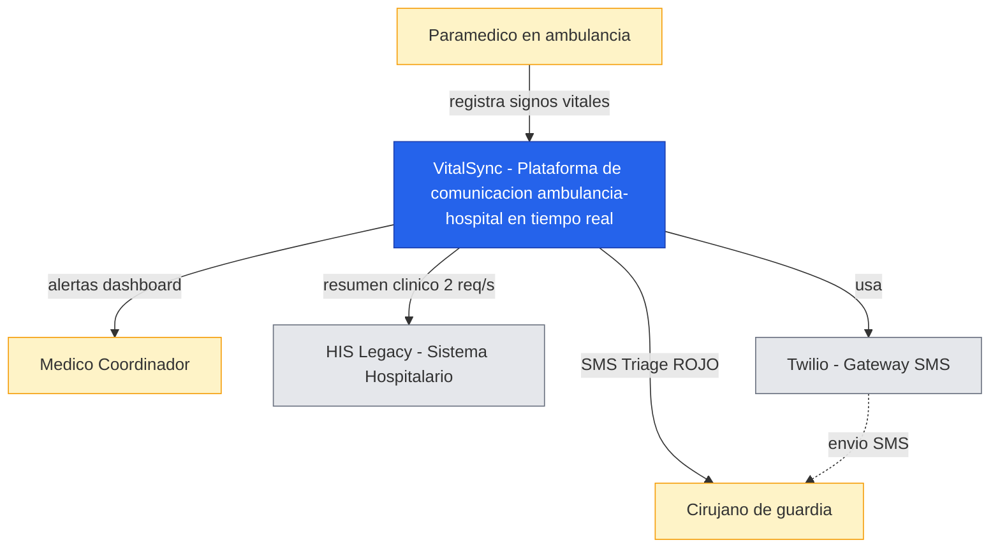

# Diagrama de Contexto (C1) — VitalSync

## Propósito

Mostrar **VitalSync como una caja única** en el centro, y todas las personas y sistemas 
externos con los que interactúa. Este es el nivel de zoom más alto: no muestra 
implementación, solo qué hace el sistema y con quién.

## Diagrama

## Explicación

### Actores (personas)

- **Paramédico**: usuario primario de la app móvil. Trabaja en condiciones extremas 
  (sin señal, con guantes, bajo presión).
- **Médico Coordinador**: mira el dashboard de la sala de emergencias, prepara quirófanos.
- **Cirujano de guardia**: recibe SMS automático para pacientes Triage ROJO.

### Sistemas externos

- **HIS Legacy**: sistema preexistente del hospital. **Frágil, lento, soporta solo 2 req/s.**
  VitalSync debe adaptarse a sus limitaciones (ver ADR-005).
- **Twilio**: servicio externo de SMS. Single point of failure mitigado con reintentos 
  (futuro: ver driver E18).

### Decisiones de diseño relevantes

- VitalSync se posiciona como **middleware** entre la ambulancia y el ecosistema 
  hospitalario existente. No reemplaza al HIS, lo integra.
- El SMS es el canal de respaldo para casos críticos donde el dashboard puede no ser 
  visto a tiempo.

## Referencias

- ADR-001: Firebase como BaaS (decisión que materializa esta caja "VitalSync")
- Entrega 1: Drivers de negocio y stakeholders