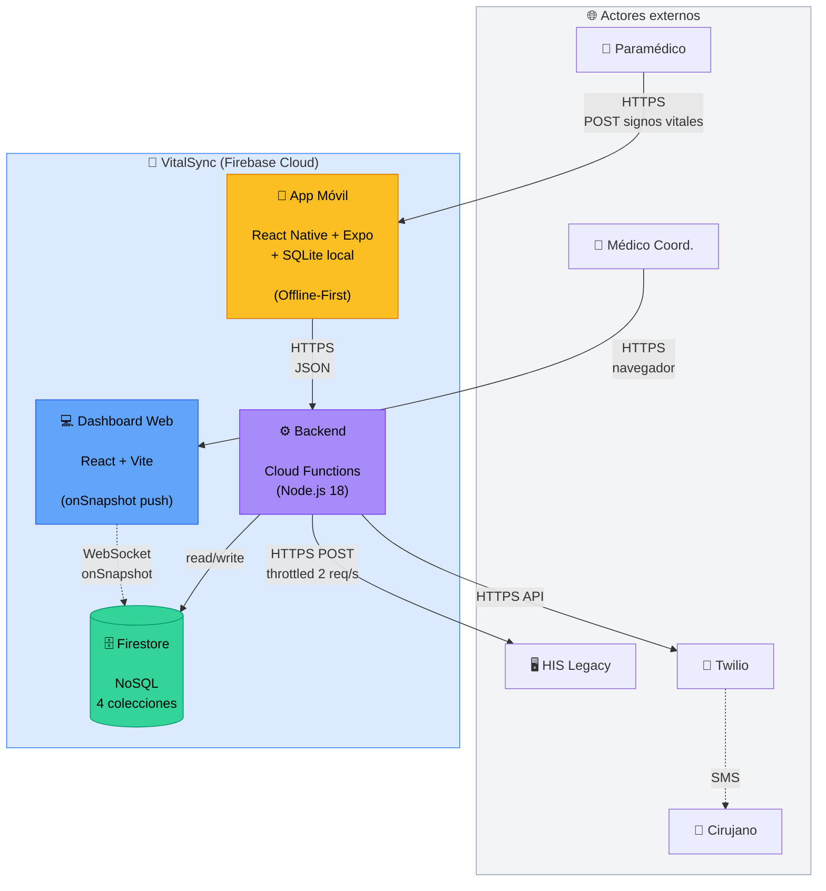

# Diagrama de Contenedores (C2) — VitalSync

## Propósito

Hacer zoom dentro de la caja "VitalSync" del diagrama de Contexto y mostrar las 
**grandes piezas técnicas** que la componen. Cada "contenedor" es una aplicación 
independiente o almacén de datos.

## Diagrama

## Explicación

### Contenedores principales

#### 📱 App Móvil
- **Tecnología**: React Native + Expo
- **Almacenamiento local**: SQLite (cola `pacientes_locales`)
- **Responsabilidad**: capturar datos del paramédico, garantizar offline-first
- **Por qué Expo**: permite desarrollar con Hot Reload en tablet sin configurar 
  Android Studio nativo

#### 💻 Dashboard Web
- **Tecnología**: React + Vite
- **Comunicación**: WebSocket persistente con Firestore via `onSnapshot`
- **Responsabilidad**: mostrar pacientes entrantes en tiempo real (< 3s)
- **Por qué Vite**: arranca en <1s, build optimizado, futuro deploy en Firebase Hosting

#### ⚙️ Backend
- **Tecnología**: Cloud Functions (Node.js 18)
- **Modelo**: serverless, sin servidor dedicado
- **Responsabilidad**: validación, idempotencia, encolado HIS, alertas SMS
- **Por qué serverless**: costo $0 en Free Tier, escala automático

#### 🗄️ Firestore
- **Tecnología**: NoSQL serverless de Firebase
- **4 colecciones**: `pacientes`, `pacientes_pii`, `cola_his`, `alertas_sms`
- **Por qué Firestore**: push automático con onSnapshot, encriptación AES-256 de fábrica

### Patrones de comunicación

| Origen | Destino | Protocolo | Tipo |
|---|---|---|---|
| App Móvil → Backend | HTTPS POST | JSON | Request/Response |
| Dashboard → Firestore | WebSocket | onSnapshot | Push (suscripción) |
| Backend → HIS | HTTPS POST | JSON | Request/Response (throttled) |
| Backend → Twilio | HTTPS API | Twilio SDK | Request/Response |

### Decisiones de diseño relevantes

- **Backend único** que actúa como anti-corrupción layer entre la app y los sistemas 
  externos (HIS, Twilio)
- **Firestore es el único punto de verdad** de los datos médicos
- **El Dashboard nunca habla con el Backend directamente**: lee de Firestore vía push, 
  cero polling

## Referencias

- ADR-001: Firebase BaaS
- ADR-002: Offline-First con SQLite (justifica el bloque interno de la app móvil)
- ADR-006: onSnapshot push (justifica la línea Dashboard ↔ Firestore)