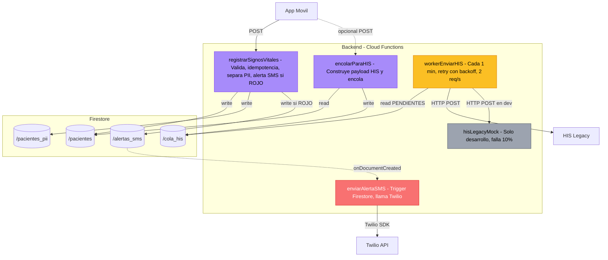

# Diagrama de Componentes (C3) — Backend

## Propósito

Hacer zoom dentro del contenedor "Backend" del diagrama C2 y mostrar las **5 Cloud 
Functions** que lo componen, junto con sus responsabilidades específicas.

## Diagrama

## Explicación

### Componentes (Cloud Functions)

#### `registrarSignosVitales` (HTTPS Trigger)

**Cuándo se ejecuta**: cuando la app móvil hace POST con datos del paciente.

**Pasos internos**:
1. Valida payload contra rangos médicos (FC, presiones, triage)
2. Consulta `/pacientes` para detectar duplicados por `requestId` (idempotencia)
3. Genera `idAnonimo` UUID
4. Escribe PII en `/pacientes_pii` (colección separada)
5. Escribe datos médicos anonimizados en `/pacientes`
6. Si triage = ROJO, crea documento en `/alertas_sms` para disparar trigger SMS

**ADRs relacionados**: ADR-003 (idempotencia), ADR-004 (separación PII), ADR-008 (validación)

#### `encolarParaHIS` (HTTPS Trigger)

**Cuándo se ejecuta**: cuando el paciente está listo para enviarse al HIS (al llegar al 
hospital o cuando el paramédico cierra el caso).

**Pasos internos**:
1. Lee paciente de `/pacientes`
2. Construye payload con formato esperado por el HIS
3. Agrega documento a `/cola_his` con estado `PENDIENTE`

**ADRs relacionados**: ADR-005 (cola con throttling)

#### `workerEnviarHIS` (Scheduled cada 1 minuto)

**Cuándo se ejecuta**: automáticamente cada minuto por el scheduler de Google Cloud.

**Pasos internos**:
1. Consulta `/cola_his` con `estado == PENDIENTE`, máximo 2 documentos por FIFO
2. Por cada uno: llama al HIS con `fetchConReintentos()` (backoff exponencial)
3. Si éxito: marca como `ENVIADO`
4. Si error 4xx: marca como `FALLIDO_PERMANENTE`
5. Si error 5xx: marca como `PENDIENTE` para reintentar
6. Espera 500ms entre cada petición (respeta 2 req/s)

**ADRs relacionados**: ADR-005 (cola), ADR-007 (retry+backoff)

#### `hisLegacyMock` (HTTPS Trigger — solo desarrollo)

**Propósito**: simular el HIS real durante desarrollo. Falla aleatoriamente 10% del 
tiempo y tarda 200-500ms. **No se despliega a producción.**

#### `enviarAlertaSMS` (Firestore Trigger)

**Cuándo se ejecuta**: automáticamente cuando aparece un documento nuevo en `/alertas_sms`.

**Pasos internos**:
1. Lee el contenido de la alerta
2. Verifica que no esté ya enviada (idempotencia)
3. Llama a Twilio SDK con número del cirujano y mensaje
4. Marca como `enviado: true` con el SID de Twilio

### Por qué este diseño

- **Single Responsibility**: cada función tiene un único propósito claro
- **Triggers desacoplados**: la alerta SMS se dispara automáticamente al escribir en 
  `/alertas_sms`, sin acoplar `registrarSignosVitales` con Twilio
- **Idempotencia distribuida**: cada función verifica idempotencia antes de actuar 
  (idempotency keys en `registrarSignosVitales`, flag `enviado` en SMS)

## Referencias

- ADR-003, ADR-004, ADR-005, ADR-007, ADR-008
- Código fuente: `functions/index.js`