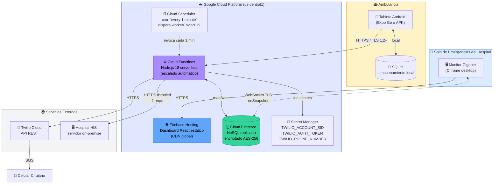

# Diagrama de Despliegue — VitalSync

## Propósito

Mostrar **dónde corre físicamente cada pieza** del sistema en la infraestructura real. 
A diferencia de los diagramas C1-C3 (que muestran lógica), este muestra **topología 
física e infraestructura**.

## Diagrama

## Explicación

### Tres mundos: cliente, nube, externos

#### 🚑 Ambulancia (cliente móvil)
- **Hardware**: tabletas Android (en MVP, una por ambulancia)
- **Conectividad**: 3G/4G intermitente
- **Almacenamiento crítico**: SQLite local sobrevive a falta de internet
- **Distribución**: APK firmado, descargado de servidor interno del hospital

#### 🏥 Sala de Emergencias (cliente fijo)
- **Hardware**: monitores grandes 4K conectados a PCs con Chrome
- **Conectividad**: red cableada del hospital, estable
- **Aplicación**: dashboard React servido desde Firebase Hosting (CDN)

#### ☁️ Google Cloud Platform (backend)

Toda la infraestructura corre en **us-central1** (Iowa, USA) por ahora. **Limitación 
conocida**: no hay región Firebase en Latinoamérica todavía. Latencia hacia Bogotá 
~80ms, aceptable para los SLAs definidos.

**Componentes de GCP usados**:

| Servicio | Propósito | Free Tier |
|---|---|---|
| Cloud Functions | Backend serverless | 2M invocaciones/mes |
| Cloud Firestore | Base de datos NoSQL | 1 GiB storage, 50K reads/día |
| Firebase Hosting | Servir dashboard estático | 10 GB transferencia/mes |
| Cloud Scheduler | Cron para workerEnviarHIS | 3 jobs gratis/mes |
| Secret Manager | Credenciales Twilio | 6 versiones gratis/mes |

#### 🌍 Servicios Externos

- **Twilio**: SaaS de telecomunicaciones (no es nuestro)
- **HIS del hospital**: servidor on-premise dentro del datacenter del hospital, accedido 
  desde Cloud Functions vía conexión HTTPS

### Encriptación end-to-end

- **App móvil → Cloud Functions**: HTTPS con TLS 1.2+
- **Dashboard → Firestore**: WebSocket sobre TLS
- **Cloud Functions → HIS**: HTTPS con certificados del hospital
- **Cloud Functions → Twilio**: HTTPS estándar
- **Datos en reposo (Firestore)**: AES-256 automático

### Decisiones de despliegue

- **Toda la nube en un solo proveedor (Google)**: reduce complejidad operativa, evita 
  costos de transferencia entre clouds
- **us-central1**: región más barata y con mayor disponibilidad de servicios. Cuando 
  Firebase abra región en Sudamérica, considerar migración para reducir latencia.
- **Secret Manager para credenciales**: nunca hardcodeadas, rotables sin redeploy

## Referencias

- ADR-001: Firebase BaaS (justifica toda la columna de GCP)
- Driver E04: Encriptación en tránsito y reposo
- Driver E08: Free Tier obligatorio