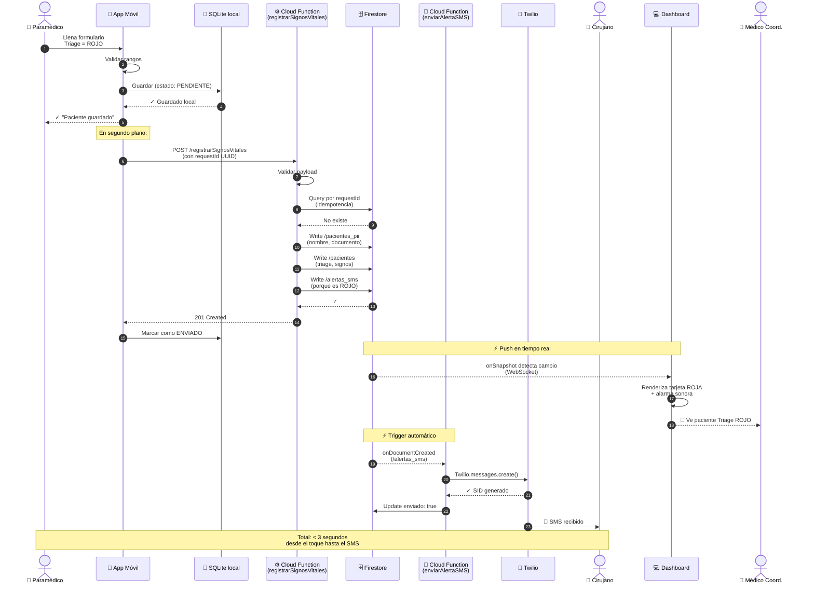

# Diagrama de Secuencia — Flujo Crítico: Paciente Triage ROJO

## Propósito

Mostrar **paso a paso** lo que ocurre desde que un paramédico envía un paciente con 
Triage ROJO hasta que el cirujano recibe el SMS y el dashboard se actualiza. Este es 
el **flujo de mayor valor del sistema** (driver E02 + alertas críticas).

## Diagrama

## Explicación

### Fases del flujo

#### Fase 1: Captura local (pasos 1-5)
El paramédico llena el formulario. La app:
1. Valida rangos médicos antes de guardar
2. Guarda en SQLite (estado PENDIENTE)
3. Da feedback inmediato al paramédico

**Esto siempre funciona, incluso sin internet.**

#### Fase 2: Sincronización con backend (pasos 6-13)
La app envía al backend en segundo plano. El backend:
- Valida (defensa en profundidad, ver ADR-008)
- Verifica idempotencia por requestId (ADR-003)
- Separa PII en colecciones distintas (ADR-004)
- Crea documento en `/alertas_sms` porque el triage es ROJO

#### Fase 3: Dos triggers paralelos (pasos 14-19)
Lo interesante: **escribir en Firestore dispara dos cosas simultáneas**:

**Rama A (push al dashboard)**:
- El listener `onSnapshot` del dashboard detecta el cambio en `/pacientes`
- Renderiza la tarjeta con borde rojo pulsante
- Reproduce alarma sonora
- El médico coordinador ve el paciente

**Rama B (trigger SMS)**:
- El listener `onDocumentCreated` del backend detecta el cambio en `/alertas_sms`
- Llama a Twilio
- El cirujano recibe el SMS

### Garantías de tiempo

| Etapa | Latencia típica medida |
|---|---|
| App → SQLite | < 50ms |
| SQLite → Cloud Function | 200-800ms (depende de red) |
| Cloud Function → Firestore | 100-200ms |
| Firestore → Dashboard | 600-1200ms (WebSocket push) |
| Firestore → SMS Trigger | 300-500ms |
| Twilio → SMS llega al cirujano | 1-3 segundos (depende de operador móvil) |

**Latencia end-to-end del dashboard**: 1-2 segundos típico, máximo 3s (cumple driver E02).

### Decisiones de diseño visibles en este flujo

1. **El paramédico no espera al backend**: la app le confirma apenas se guarda local.
2. **Los triggers son asincrónicos**: dashboard y SMS no se bloquean entre sí.
3. **Idempotencia múltiple**: el `requestId` protege contra duplicados en el backend, 
   y el flag `enviado` protege contra SMS duplicados.

## Referencias

- ADR-002: Offline-First (Fase 1)
- ADR-003: Idempotencia (paso 8)
- ADR-004: Separación PII (pasos 10-11)
- ADR-006: Dashboard push (Rama A)
- Driver E02: Latencia < 3s end-to-end