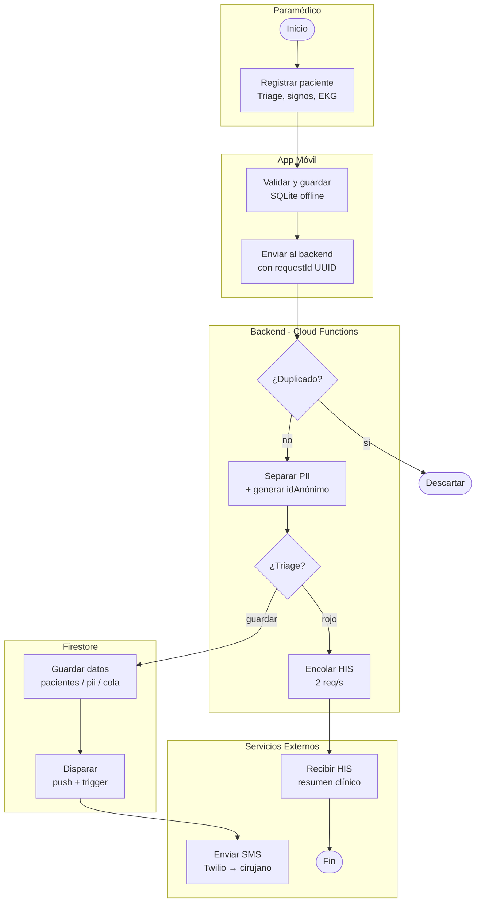

# Diagrama BPMN — Flujo Triage Rojo (VitalSync)

```mermaid
flowchart TD
    subgraph PARA["Paramédico"]
        ini([Inicio]) --> reg["Registrar paciente<br/>Triage, signos, EKG"]
    end

    subgraph APP["App Móvil"]
        val["Validar y guardar<br/>SQLite offline"] --> env["Enviar al backend<br/>con requestId UUID"]
    end

    subgraph BACK["Backend - Cloud Functions"]
        dup{"¿Duplicado?"}
        pii["Separar PII<br/>+ generar idAnónimo"]
        tri{"¿Triage?"}
        cola["Encolar HIS<br/>2 req/s"]
    end

    subgraph FS["Firestore"]
        guarda["Guardar datos<br/>pacientes / pii / cola"] --> disp["Disparar<br/>push + trigger"]
    end

    subgraph EXT["Servicios Externos"]
        sms["Enviar SMS<br/>Twilio → cirujano"]
        his["Recibir HIS<br/>resumen clínico"] --> fin([Fin])
    end

    reg --> val
    env --> dup
    dup -->|sí| descarta([Descartar])
    dup -->|no| pii
    pii --> tri
    tri -->|guardar| guarda
    tri -->|rojo| cola
    disp --> sms
    cola --> his
```